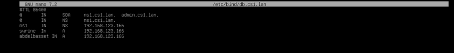
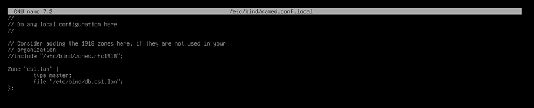
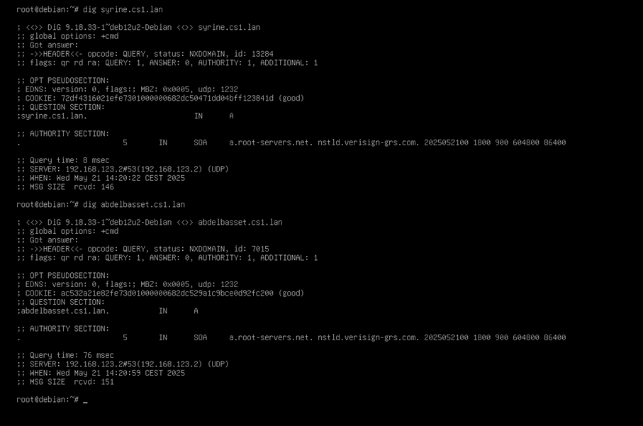
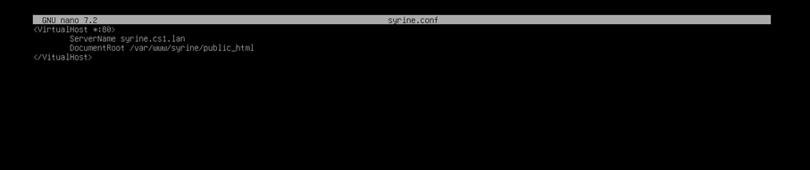
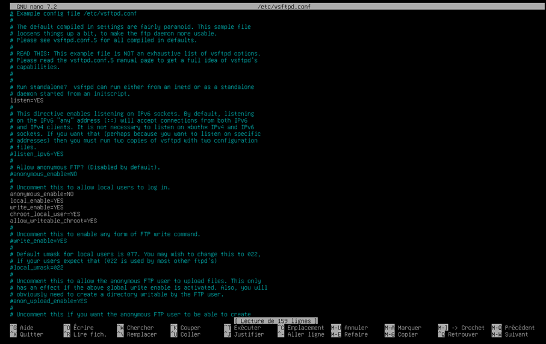
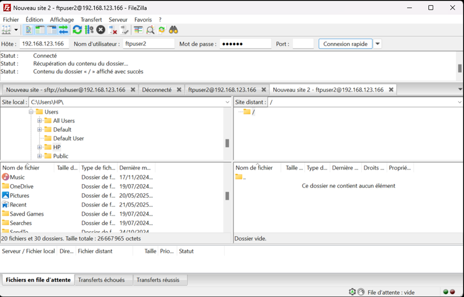
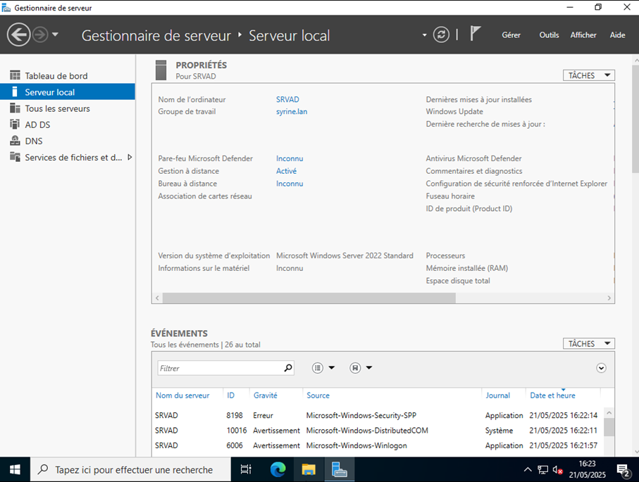
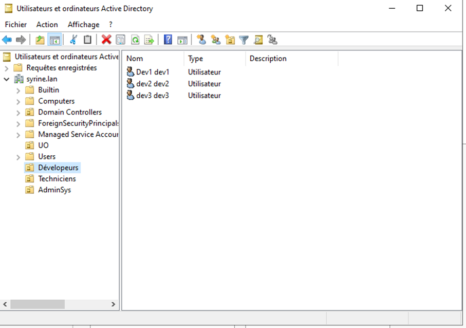
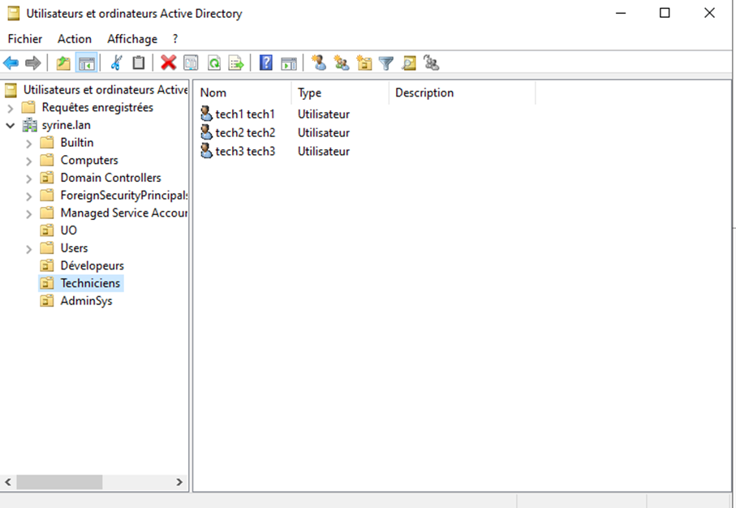

# Infrastructure de Services - Apache & Active Directory

## Table des matières
- [Présentation du projet](#-présentation-du-projet)
- [Partie 1 : Apache - Hébergement Web](#-partie-1--apache---hébergement-web)
  - [Configuration DNS](#configuration-dns)
  - [Configuration Apache (VirtualHost)](#configuration-apache-virtualhost)
  - [Configuration FTP](#configuration-ftp)
  - [Résultats](#résultats)
- [Partie 2 : Active Directory](#-partie-2--active-directory)
  - [Mise en place du domaine](#mise-en-place-du-domaine)
  - [Création des Unités d'Organisation](#création-des-unités-dorganisation)
  - [Gestion des utilisateurs](#gestion-des-utilisateurs)
  - [Stratégies et restrictions](#stratégies-et-restrictions)
- [Architecture technique](#-architecture-technique)
- [Prérequis](#-prérequis)
- [Auteure](#-auteure)

## Présentation du projet

Ce projet consiste à mettre en place une infrastructure de services complète pour une entreprise, avec deux composants majeurs :

1. **Service d'hébergement web mutualisé** avec Apache pour deux clients
2. **Service d'annuaire Active Directory** avec gestion fine des utilisateurs et des droits

L'objectif est de maîtriser la configuration de services réseau essentiels : DNS, Apache, FTP, et Active Directory.

---

## Partie 1 : Apache - Hébergement Web

### Description

En tant qu'hébergeur web, j'ai configuré un serveur pour accueillir deux sites web mutualisés pour deux clients avec les noms de domaine :
- `syrine.cs1.lan`
- `abdelbasset.cs1.lan`

### Configuration DNS

La première étape a consisté à créer les enregistrements DNS pour que les noms de domaine résolvent vers le serveur.

**Création de la zone DNS :**

**Enregistrements DNS :**

**Vérification de la configuration :**

### Configuration Apache (VirtualHost)

J'ai créé deux VirtualHosts, un pour chaque domaine, avec leurs propres répertoires racine.

**VirtualHost pour syrine.cs1.lan :**

**VirtualHost pour abdelbasset.cs1.lan :**

### Configuration FTP

Pour permettre aux clients d'uploader leurs fichiers, j'ai configuré un serveur FTP avec des accès dédiés pour chaque site.

**Configuration du serveur FTP :**

### Résultats

> **Note :** L'affichage des sites dans le navigateur n'a pas pu être finalisé par manque de temps, mais toute la configuration sous-jacente est en place et fonctionnelle.

---

## Partie 2 : Active Directory

### Description

Mise en place d'un domaine Active Directory pour l'entreprise avec le nom de domaine `abdelbasset.lan` et un serveur nommé `SRVAD`.

### Mise en place du domaine

**Promotion du serveur en contrôleur de domaine :**

### Création des Unités d'Organisation

Trois Unités d'Organisation (UO) ont été créées pour structurer les équipes :

| UO | Description |
|-----|-------------|
| **Développeurs** | Équipe de développement |
| **Techniciens** | Équipe support technique |
| **AdminSys** | Équipe d'administration système |

**UO Développeurs :**

**UO Techniciens :**

**UO AdminSys :**

### Gestion des utilisateurs

Neuf utilisateurs ont été créés, répartis dans les trois UO :

| UO | Utilisateurs |
|-----|--------------|
| Développeurs | Dev1, Dev2, Dev3 |
| Techniciens | Tech1, Tech2, Tech3 |
| AdminSys | Admin1, Admin2, Admin3 |

### Stratégies et restrictions

#### 1. Restriction pour les développeurs 

**Objectif :** Les développeurs ne doivent pas avoir accès au CMD (invite de commandes).

#### 2. Lecteur réseau partagé Z:

**Objectif :** Tous les utilisateurs ont un lecteur mappé Z: pointant vers un dossier COMMUN avec droit de modification pour tous.

#### 3. Dossier de base pour Admin2

**Objectif :** Admin2 dispose d'un dossier de base personnel mappé sur le lecteur P:.

#### 4. Restrictions horaires pour les techniciens 

**Objectif :** Les techniciens ne peuvent se connecter que du lundi au vendredi, de 8h à 19h.

**Configuration des horaires de connexion :**

---

##  Architecture technique

### Services configurés

| Service | Rôle | Configuration |
|---------|------|---------------|
| **DNS** | Résolution de noms | Zones pour `cs1.lan` |
| **Apache** | Serveur web | 2 VirtualHosts |
| **FTP** | Transfert de fichiers | Accès dédiés par site |
| **Active Directory** | Annuaire | Domaine `abdelbasset.lan` |
| **Stratégies de groupe** | Restrictions | CMD, horaires, lecteurs |

---

##  Prérequis

- **Système d'exploitation :** Windows Server (pour AD) ou Linux (pour Apache/DNS/FTP)
- **Logiciels installés :**
  - Apache
  - Serveur DNS (bind ou DNS Windows)
  - Serveur FTP (vsftpd, FileZilla Server, ou IIS FTP)
  - Active Directory Domain Services
- **Client de test :** Windows 10/11 pour tester les connexions AD
- **Outil FTP :** FileZilla ou autre client FTP

---

##  Auteure

**ABDELBASSET Syrine**  
Bachelor 1 Cybersécurité & Ethical Hacking

---

## Notes complémentaires

- La partie Apache est entièrement configurée (DNS, VirtualHosts, FTP), seule l'affichage final des sites n'a pas pu être validé par manque de temps
- Toutes les fonctionnalités Active Directory ont été implémentées avec succès :
  - ✅ Structure UO complète
  - ✅ 9 utilisateurs créés
  - ✅ Restriction CMD pour développeurs
  - ✅ Lecteur réseau Z: partagé
  - ✅ Dossier personnel pour Admin2
  - ✅ Restrictions horaires pour techniciens

---

